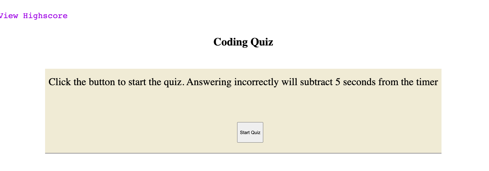

# code-quiz

Description: This application uses javascript to generate a timed coding quiz. The user will click through the quiz, and time is deducted if they click on a wrong answer. At the end, the user has the opportunity to save their high score with their initials.

Installation: N/A

Usage: Please visit this link: https://clairebain3.github.io/code-quiz/

Credits N/A

License Please refer to the license in the repo

